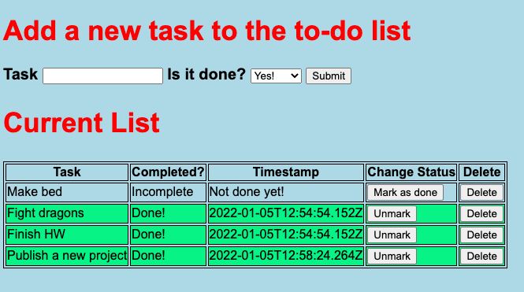

# Project Name

The Weekend SQL To-Do List

## Description
  
UPDATE: For the sake of securely hosting this project on Heroku, all of the AJAX CRUD operations have been overwritten with javascript calculations and a default array. The original code is commented out here on Github, but still included for reference.
  
The problem solved was utilizing the AJAX (Asynchronous Javascript And XML) suite of methods to communicate with servers. In turn, we used a PostgreSQL database and related packages to implement CRUD (Create, Read, Update & Delete) operations with data from the database as well as from the server & front end.

## Prerequisites

*   [Node.js](https://nodejs.org/en/download/)
*   [PostgreSQL](https://www.postgresql.org/download/)
*   [Express](https://expressjs.com/en/starter/installing.html)

## Installation

1.  Download or clone the repository.
2.  Create a database using the code from the database.sql file (./server/database_details/database.sql) in your preferred database client (I used [Postico](https://eggerapps.at/postico/)).
2.  Run `npm install` in the terminal.
3.  Launch the server by typing `npm start`.
4.  Open up `localhost:5000` in your web-browser.

##  Usage

This app can be used to keep track of tasks and objectives, marking them off in real time.

A user who has a messy house and a busy programming class and need to keep track of everything they need to complete in a day. This app allows them to refresh tasks on a new day if they are required daily, or delete instance specific tasks.

## Built with

* [jQuery](https://jquery.com/)
* Javascript
* HTML
* Tested with Jquery & [Postico](https://eggerapps.at/postico/)

## Acknowledgement

Thanks to Prime Digital Academy.